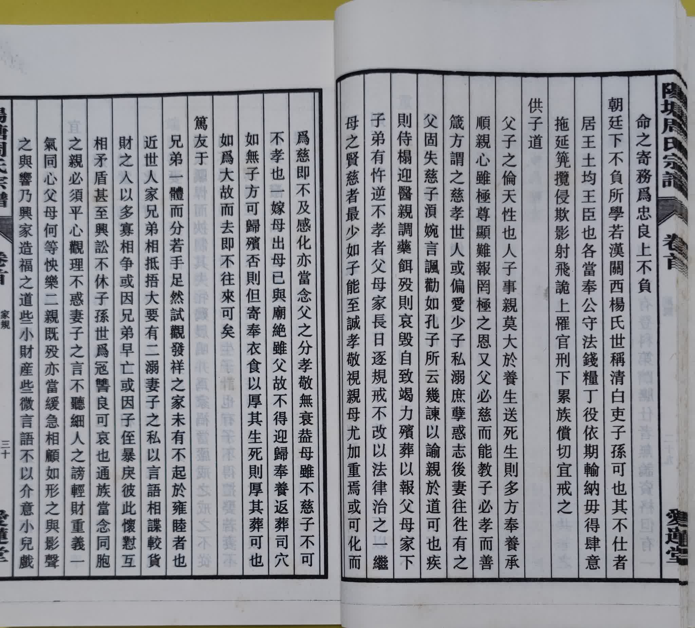
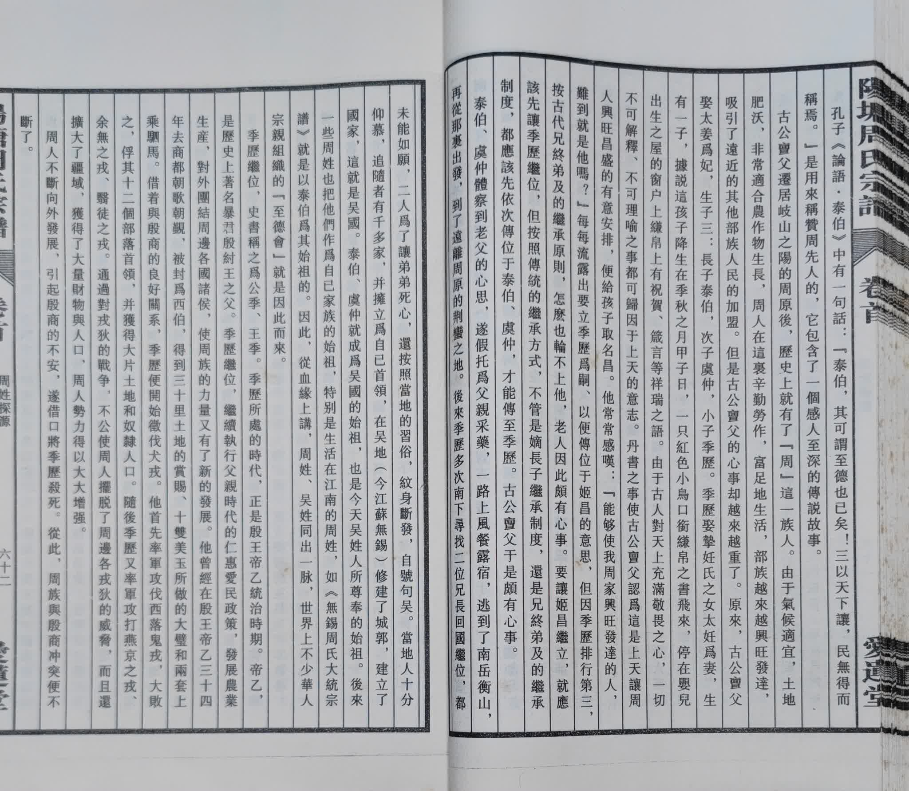
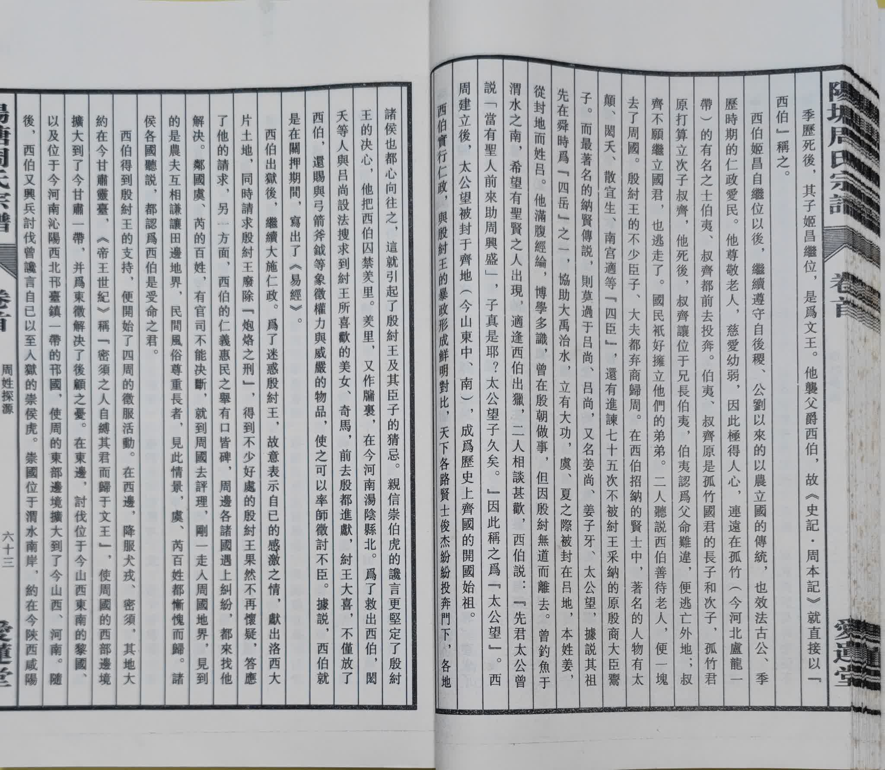
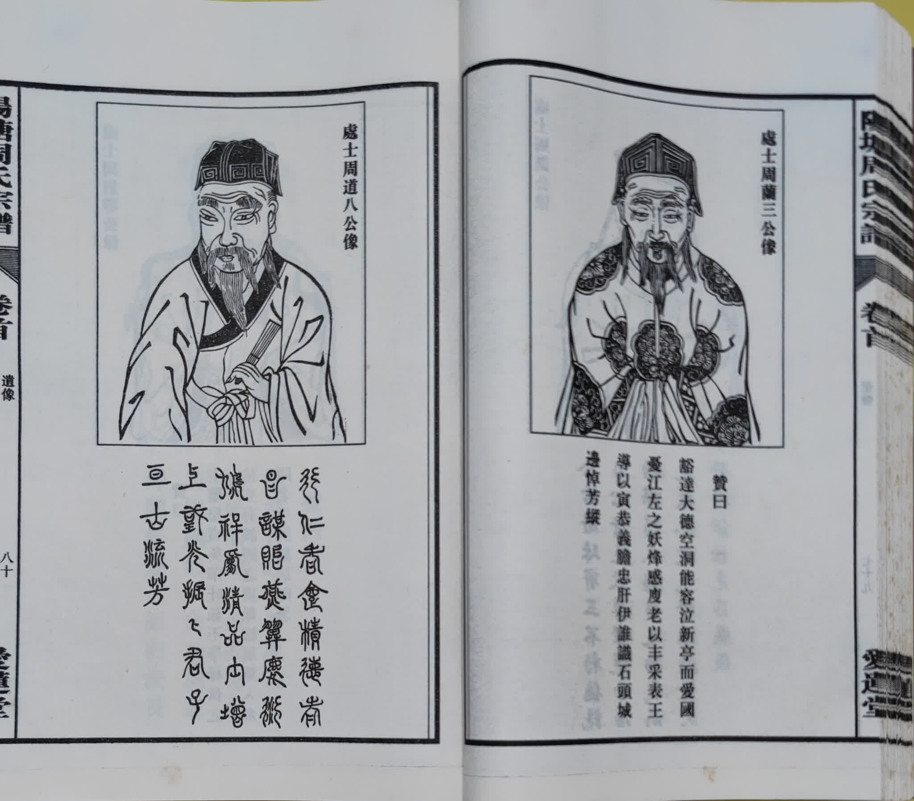

**阳塘 周氏宗谱**

**卷之首**

**目录**
- [卷之首封面](#卷之首封面)
- [目录](#目录)
  - [家乘之宝，目录2](#家乘之宝目录2)
  - [目录3](#目录3)
- [领谱字号](#领谱字号)
- [谱序一至七修](#谱序一至七修)
  - [阳塘周氏初修谱序](#阳塘周氏初修谱序)
  - [阳塘周氏再修谱序](#阳塘周氏再修谱序)
  - [阳塘周氏三修谱序](#阳塘周氏三修谱序)
  - [阳塘周氏四修谱序](#阳塘周氏四修谱序)
  - [阳塘周氏五修谱序](#阳塘周氏五修谱序)
  - [阳塘周氏六修谱序](#阳塘周氏六修谱序)
  - [阳塘周氏七修谱序](#阳塘周氏七修谱序)
- [周字考略](#周字考略)
- [凡例](#凡例)
- [周氏家规](#周氏家规)
- [名家谱说](#名家谱说)
- [修谱五难](#修谱五难)
- [谱有五不书](#谱有五不书)
- [谱有六书](#谱有六书)
- [朱子文集](#朱子文集)
- [家居要言](#家居要言)
- [历代人物录](#历代人物录)
- [像赞引](#像赞引)
- [周姓探源](#周姓探源)
- [公略传](#公略传)
  - [周处](#周处)
  - [周舍](#周舍)
  - [周傅](#周傅)
  - [周勃](#周勃)
  - [周亚夫](#周亚夫)
  - [周璆](#周璆)
  - [周敦颐](#周敦颐)
  - [周寿](#周寿)
  - [周文忠](#周文忠)
- [遗像](#遗像)
- [新人物谱引](#新人物谱引)
- [始祖墓地与阳塘](#始祖墓地与阳塘)
- [梅山，团山，茶亭](#梅山团山茶亭)
- [封底](#封底)
- [缺页待补](#缺页待补)

# 卷之首封面

# 目录

## 家乘之宝，目录2

## 目录3

# 领谱字号

# 谱序一至七修

## 阳塘周氏初修谱序

## 阳塘周氏再修谱序

## 阳塘周氏三修谱序

## 阳塘周氏四修谱序

## 阳塘周氏五修谱序

## 阳塘周氏六修谱序

## 阳塘周氏七修谱序

# 周字考略

# 凡例

# 周氏家规

# 名家谱说

# 修谱五难

# 谱有五不书

# 谱有六书

# 朱子文集

# 家居要言

# 历代人物录

# 像赞引

# 周姓探源

# 公略传

## 周处

## 周舍

## 周傅

## 周勃

## 周亚夫

## 周璆

## 周敦颐

## 周寿

## 周文忠

# 遗像

# 新人物谱引

**为了保护个人信息将跳过95～102页的介绍页面。**

# 始祖墓地与阳塘

# 梅山，团山，茶亭

# 封底

# 缺页待补
- 十五页
