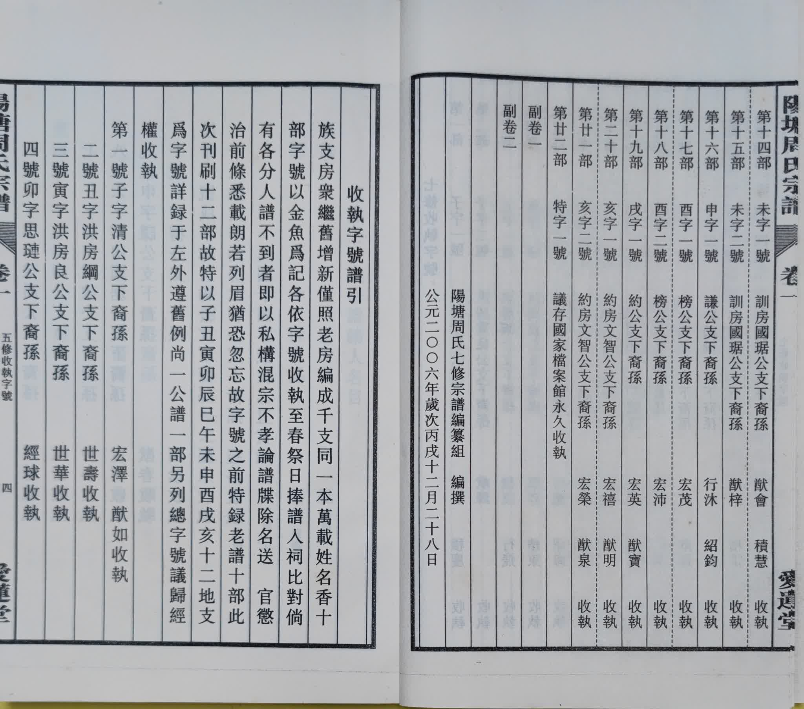
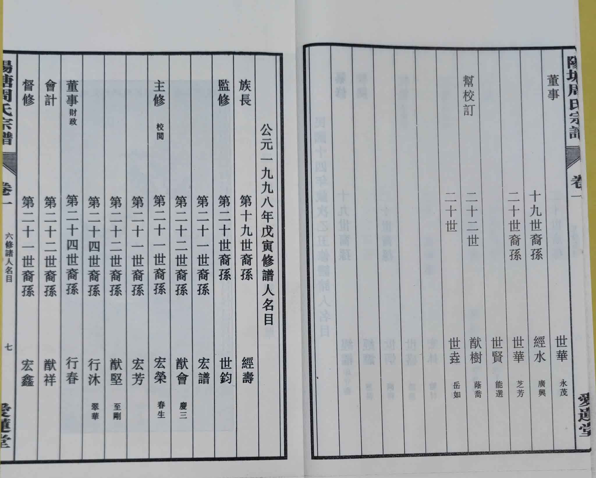
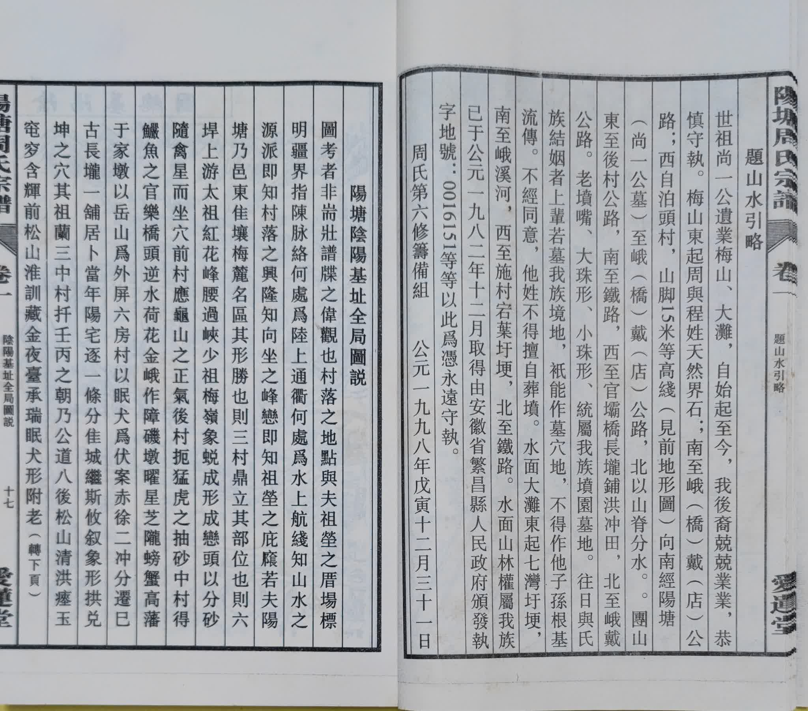
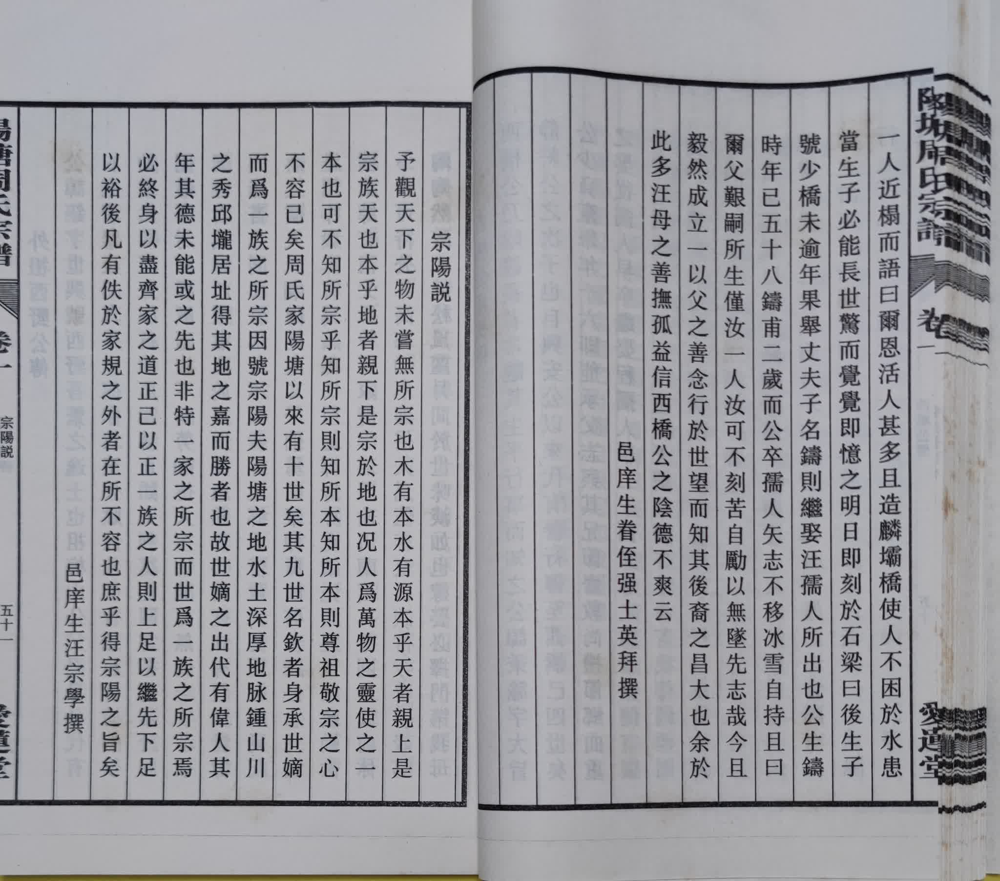
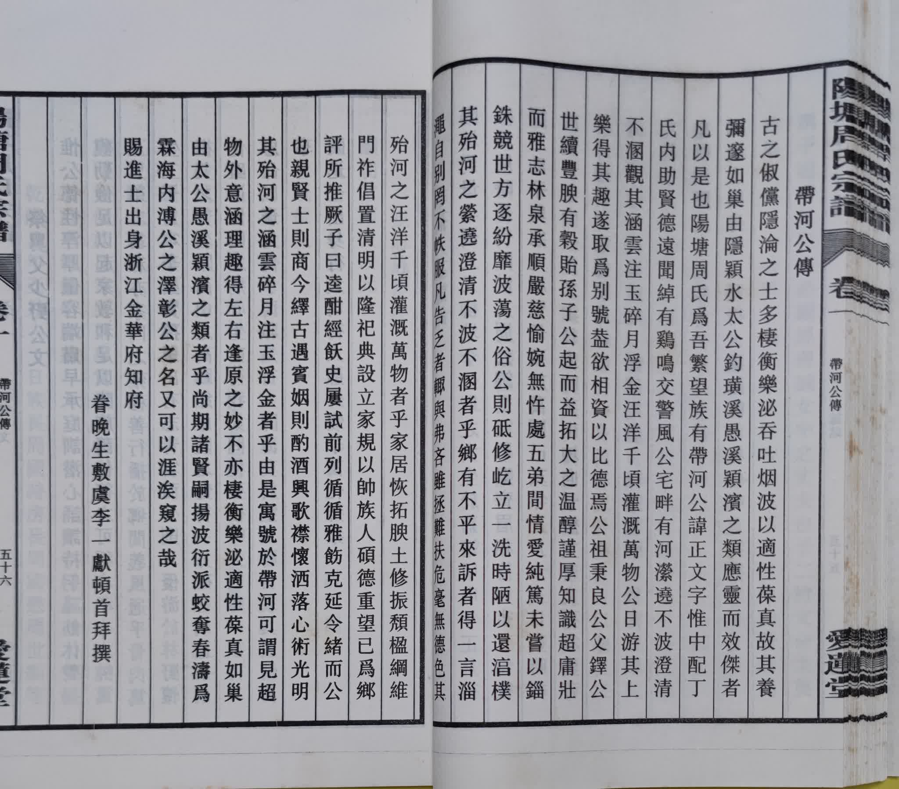
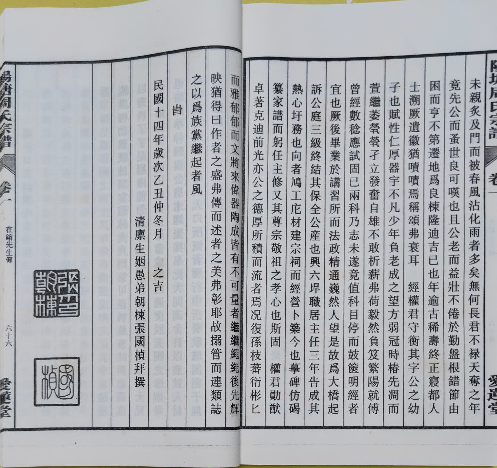

**阳塘 周氏宗谱**

**卷之一**

**目录**
- [封面](#封面)
- [目录](#目录)
  - [目录](#目录-1)
  - [水源](#水源)
- [七修宗谱收執谱引，字号](#七修宗谱收執谱引字号)
  - [木本](#木本)
  - [收執字号谱引](#收執字号谱引)
  - [七修收執字号](#七修收執字号)
- [五修宗谱收執字号](#五修宗谱收執字号)
- [四修名录，乾隆壬子岁修谱诸人名录](#四修名录乾隆壬子岁修谱诸人名录)
- [五修名录，民国十四年岁次乙丑修谱诸人名录](#五修名录民国十四年岁次乙丑修谱诸人名录)
- [六修名录，公元一九九八年戊寅修谱人名录](#六修名录公元一九九八年戊寅修谱人名录)
- [七修名录，公元二零零六年丙戌修谱成员名单](#七修名录公元二零零六年丙戌修谱成员名单)
- [祠堂记](#祠堂记)
  - [祠堂图](#祠堂图)
- [旌奖御杯引](#旌奖御杯引)
- [阳塘周氏方域图](#阳塘周氏方域图)
- [阳塘阴阳基址全局图说](#阳塘阴阳基址全局图说)
  - [题山水引略](#题山水引略)
  - [阳塘阴阳基址全局图说](#阳塘阴阳基址全局图说-1)
  - [阴阳基总图](#阴阳基总图)
  - [前分阳基图说](#前分阳基图说)
  - [后分阳基图说](#后分阳基图说)
  - [中分阳基图说](#中分阳基图说)
  - [小淮窑阳基阳说](#小淮窑阳基阳说)
  - [阴基图](#阴基图)
- [阳塘十二景诗](#阳塘十二景诗)
- [六修赞诗](#六修赞诗)
- [前人传，赞，墓志铭，旌节路录](#前人传赞墓志铭旌节路录)
- [周氏排行引](#周氏排行引)
  - [蘭道升言思水秉](#蘭道升言思水秉)
  - [金文土中国之顯](#金文土中国之顯)
  - [有学开经世宏猷](#有学开经世宏猷)
  - [积行绍传家巨典](#积行绍传家巨典)
  - [岁朝图](#岁朝图)
  - [七修谱新增排行引](#七修谱新增排行引)
    - [玉德为荣厚仁义](#玉德为荣厚仁义)
    - [明理启祥承贤良](#明理启祥承贤良)
- [周氏历代世系渊源图](#周氏历代世系渊源图)
- [年年有余图](#年年有余图)
- [封底](#封底)

# 封面

# 目录

## 目录
## 水源

# 七修宗谱收執谱引，字号
## 木本
## 收執字号谱引

## 七修收執字号

# 五修宗谱收執字号

# 四修名录，乾隆壬子岁修谱诸人名录

# 五修名录，民国十四年岁次乙丑修谱诸人名录

# 六修名录，公元一九九八年戊寅修谱人名录

# 七修名录，公元二零零六年丙戌修谱成员名单

# 祠堂记

## 祠堂图

# 旌奖御杯引

# 阳塘周氏方域图

# 阳塘阴阳基址全局图说
## 题山水引略
## 阳塘阴阳基址全局图说

## 阴阳基总图

## 前分阳基图说

## 后分阳基图说

## 中分阳基图说

## 小淮窑阳基阳说

## 阴基图

# 阳塘十二景诗

# 六修赞诗

# 前人传，赞，墓志铭，旌节路录

# 周氏排行引

## 蘭道升言思水秉
## 金文土中国之顯
## 有学开经世宏猷
## 积行绍传家巨典

## 岁朝图
## 七修谱新增排行引
### 玉德为荣厚仁义
### 明理启祥承贤良

# 周氏历代世系渊源图

# 年年有余图

# 封底

